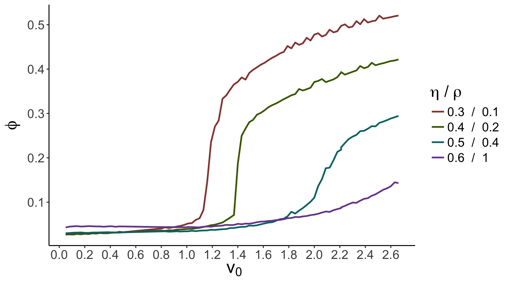

# EFFECT OF INTERACTION-RULES VARIATION ON COLLECTIVE MOTION SYSTEMS

---

# INTRODUCTION

---

## Collective motion
- Qué es
- Cómo se estudia

### INTRODUCTION
---
## Rules of interaction
- Qué son
- Ventajas adaptativas

### INTRODUCTION
---

# GOALS
- Study the impact of the variation in group and individual interaction-rules:
    - Ordering,
    - Information transfer
    - Decision-making

- Compare emergent behaviors with those observed in animal collectives with flocking behavior.

---

# PRELIMINARY RESULTS

---

## Vicsek model

- Model of self-propelled particles (SPP)
- Vicsek et al. (1995)
- Imitates flocking behavior:
  - Integrates natural perturbations in particles' direction of motion.  

- Parámeters:
Density $\rho$: Number of particles $N$ in a volume $R^d$ ($d$ is the dimension).  
Velocity $v_{0}$  
Noise amplitude $\eta$    

(FUNCIÓN DE RUIDO)

Order parameter: Average normalized velocity $\phi$,

$$ \phi = \frac{1}{N v_{0}} \left| \sum_{i=1}^{N} \vec{v_{i}} \right| $$

#### PRELIMINARY RESULTS

Note:
Agregar un esquema con partículas.
Describes particles moving at constant velocity.
At each time unit, each particle i changes its orientation depending on the average orientation of its neighbors (neighborhood of radius R_0 centered in i) and a noise term that represents perturbations.
---

## Phase transitions in the Vicsek model

First order vs. Second order as a function of $\eta$

(GRÁFICA DE VICSEK, 1999 y de GREGOIRE, 2004)

Note:
Estudiar transiciones de fase y la diferencia entre los dos estudios.

---

## Phase transition as a function of particles' velocity

Fish collectives: increase in polarization when fish increase their swimming speed (\cite{Gautrais2012}      \cite{Tunstrom2013}  \cite{Rieucau2014})

(VIDEO DE PECES)

---

#### ¿Is it possible to reproduce the velocity-dependent disorder-to-order phase transition in a model as simple as the Vicsek model?

---

### Our simulations

#### Computational optimization of the Vicsek model

- System $L^2$ divided in boxes of size $R_{0} = 1$, and each particle is assigned to a given box. (Ginelli et al. 2016)
- First calculate the sum of particles' orientation for each box, and update their positions aftewards.

#### Simulations

Changes in the time-average order parameter $\phi$ as particles' velocity is increased.
  - $N$ = 10,000
  - $\rho$ from 0.1 to 2

---

### To fix $\eta$

Values of $\eta$ where disorder and order states are observed:

GRAFICA

$\eta$ = 0.3, 0.4, 0.5 and 0.6

---
### Changes in $\phi$ by changing $v_{0}$ and $\rho$

- Disorder-to-order phase transition
- As $\eta$ is increased, the transition ocurrs at higher $v_{0}$ and $\rho$ values.

Note:
Hacer análisis de por qué ocurre esto!

---
### Nature of velocity induced phase transition

- For each $\eta$, a value of $\rho$ was chosen where a transition was observed

- After a $v_{0}$ threshold value, a phase transition compatible with a first-order transition is observed:

layout: top-right
