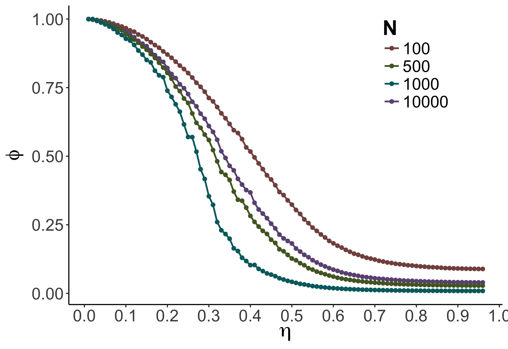
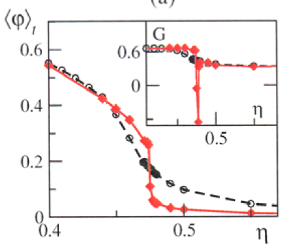

## EFFECT OF INTERACTION-RULES VARIATION ON COLLECTIVE MOTION SYSTEMS

Julia Múgica Gallart  

Thesis directors:  

- Dr. Romulado Pastor-Satorras

- Dra. M. Carmen Miguel López

---?image=flocking_birds.jpg&position=right&size=50% 100%

@div[left-50]
##  INTRODUCTION

---?image=collective_motion.png&position=right&size=36% 60%
## Collective motion
@div[left-60]
@ul[brighten]

- Similar individual units that **interact**:
  - Speed
  - Direction of motion
  - Distance to each other.

- No central control: self-organization.

- Different “phases”: disorder vs. order.

- Wide range of biological systems.

@ulend
@divend

Note:
- Collective motion is a type of behavior that consists of similar agents interacting in such a way that they achieve a coherent group displacement. By coherent i mean they adjust their speed, direction of motion and distance to each other to achieve cohesion and synchronization.

- This is done without any central control, i.e. the system self-organizes.

- From the way agents interact, different phases can emerge: from disorganized aggregations to coordinated and polarized groups.

- Moving collectively endows with adaptive properties to individuals, specially on foraging (like finding food more rapidly), and in anti-predation strategies (like, the dilution effect, that decreases individuals probability of being taken by a predator as group size increases, or the many-eyes effect that increases the probability of detecting a predator more rapidly). And due to this adaptive advantage collective motion is observed in a wide range of biological systems; including bacterial colonies, social insects, fish schools, bird flocks and human crowds.

---?image=study_approaches-1.png&position=right&size=20% 60%
### The study of collective motion
@ul[brighten]
- Universality of the phenomenon.
@div[left-70]
- @color[#FFBB00](Theoretical approaches)
  - Models of self-proppelled particles (SPP).
  - Variation of the rules of interaction.

- @color[#FFBB00](Experimental approaches)
  - High precision data of animals on the move.

@divend
@ulend
Note:
- The underlying fundamental principles of collective motion are usually generalized, and therefore nearly independent of the specific details relative to the behavior of individual components, so they are transferable between systems of different nature. This characteristic is known as universality, and coupled with the many technological applications inspired by collective models, has attracted the attention of statistical physicists and theoretical biologists, as well as experimental scientists.

- In theoretical approximations, the mechanisms by which local interactions between agents generate emergent global patterns is investigated with models of self-propelled particles with interaction rules that can be varied.

- In experimental approaches, the advances in tracking and image technologies have enabled to obtain high precision data of animals on the move and make and accurate analysis of individual behavior.

- With this data, it is possible to compare the observations with simulated data results, and infer the underlying mechanisms of communication in collective motion events.

---
## @color[#FFBB00](Rules of interaction)
@ul[brighten]
- Flexibility in collective decision-making and information transfer processes.)

- Source of diversity of structures and dynamics observed in nature.

- Individual and global variations.
@ulend
Note:
- The different ways in which individuals interact give flexibility to a group in decision-making and information transfer processes. They seem to be the source of the diversity of structures and dynamics of collective motion observed in nature. In recent theoretical and experimental works, these differences have been explored, and it has been shown that animals can be subject to both behavioral group and individual variations.

+++
#### Variation in the rules of interaction
@ul[brighten]

- @color[#FFBB00](Group variation)

  - Changes in the frequency and force of interactions.
  - External perturbations or internal states.
  - Group's capacity to exhibit multiple stable collective states.

- @color[#FFBB00](Individual variation)

  - Difference in the rules of interaction within a group.
  - Internal states, body-size, information or experience disparities.
  - Emergence of leader-follower dynamics.

@ulend

Note:
Global variations

- Group variation refers to changes in the frequency and the force by which individuals interact (By force i mean individuals' probability of responding to the movements of their neighbors), without changing the rules of interaction *per se*.

- Group variation can occur as a response to an external perturbation, to internal states, or to different stages of development.

- This variation expresses in groups' capacity to exhibit mutiple stable collective states: swarming to schooling to milling.

Individual variations

- Individual variation expresses in the difference in the rules of interaction within a group.

- This can be a consequence of factors that affect the preferred individual's speed and direction (different body sizes, specific internal states) or to intrinsic differences in their behavior (more experiences individuals, familiarity, socially dominant) that change attention an individual puts on their neighbors in decision making processes.

- Individual variation often causes the emergence of leader-follower dynamics (i.e. variations in individuals' probability to follow others).

These variations are relevant to understand which strategies groups can adopt to transfer information and endow some members with greater weight in the collective decision-making.

---

## GOALS
@ul[brighten]
- Study the impact of the variation in group and individual interaction-rules:

    - Ordering
    - Information transfer
    - Decision-making

- Compare emergent behaviors with those observed in animal collectives with flocking behavior.
@ulend

---
#### SPECIFIC GOALS

- @color[#FFBB00](Variation in agents' velocity.)
  - Impact on the ordering of the system.
  - Numeric simulations of SPPs and experimental fish data.

- @color[#FFBB00](Leader-follower relationships.)
  - Information transfer and collective decision-making
  - Different social and environmental contexts.
  - Swarms of mini-robots.

Note:
- For this purpose, we are currently working with experimental data with swarms of interacting autonomous mini-robots to examine leader-follower dynamics, and with numeric simulations using simple models of self-propelled particles (SPP) to examine phase transitions when particles velocity is increased.

---

# PRELIMINARY RESULTS

---?image=Vicsek_dynamics.png&position=right&size=35%

## @color[#FFBB00](Vicsek model)

- Model of self-propelled particles (SPP).  

- Vicsek et al. (1995).  

- Integrates natural perturbations in   
the direction of motion.  

Note:

We chose the Vicsek model for our numeric simulations to investigate changes in the ordering of the system as a function of particles' velocity.

The Vicsek model is the first model designed to quantitatively interpret flocking behaviors. It represents the simplest model displaying a transition to collective motion similar to
the one observed in flocks (schools, herds). This is achieved by taking into account the natural perturbation a flock is affected by, integrating it as a random "noise" angle that deviates the direction of motion of every particle.

This model describes the dynamics of a collection of SPPs moving at a constant velocity, and at each time unit, each particle $i$ changes its orientation depending on both the average orientation of its neighbors (defined by a neighborhood of radius $R_{0}$ centered on $i$) and a noise term representing perturbations.

---

### Parameters:

- Density $\rho$: Number of particles $N$ in a volume $R^d$.

- Velocity $v_{0}$

- Noise amplitude $\eta$: white noise uniformly distributed in $[-\pi , \pi]$

- Order parameter $\phi$:Average normalized velocity,

`$$ \phi = \frac{1}{N v_{0}} \left| \sum_{i=1}^{N} \vec{v_{i}} \right| $$`

Note:
The parameters of the model are the density of particles, meaning, the number of particles N in a volume. The velocity v_0, the noise amplitude and the order parámeter phi.
**ESTO NECESITA PRÁCTICA**
---

## Phase transitions in the Vicsek model

- First order vs. Second order phase transition as a function of $\eta$:

@div[left-50]
Vicsek et al. 1995

@divend

@div[right-50]
Gregoire and Chaté, 2008

@divend

Note:
Phase transitions in the Vicsek model have been particularly subject for debate. In their first paper, Vicsek and company showed that when $\eta$ is increased, the system undergoes a phase transition from an ordered state where all the particles move in the same direction, to a disordered state where the particles move in random directions. They categorized the order-to-disorder phase transition as a second-order transition occurring at a critical noise value.
Nevertheless, Gregoire and Chaté, in 2008, analyzed the Vicsek model with larger system sizes with many more particles moving at higher velocities, and they found a order-to-disorder first-order transition.
**FALTA: VER CONDICIONES DE SIMULACIÓN DE CHATÉ, Y EN QUÉ VA ESA DISCUSIÓN**

- This has resulted in a number of studies investigating phase transitions varying system's parameters \cite{Aldana2009}.
---?image=Figure_S10.png&position=right&size=20% 60%

### Phase transition as a function of agents' velocity
@div[left-65]
@ul[brighten]

- Observations on fish collective motion:
  - Higher polarization ($\phi$) at higher swimming speeds ($v_0$). Gautrais et al. 2012; Tunstrom et al. 2013, Rieucau et al. 2014

- @color[#FFBB00](¿Is the disorder-to-order phase transition reproducible in a model as simple as the Vicsek model?)
@ulend
@divend

Note:
Nevertheless, to our knowledge there is very few literature related to the model's dependence on particles velocity, so we wanted to fill this gap by focusing on the effect of increasing $v_{0}$ on the ordering of the system.

The occurrence of a velocity dependent phase transition has been detected in various fish species that show an increase in group's average polarization when individuals increase their swimming speed \cite{Gautrais2012}  \cite{Tunstrom2013}  \cite{Rieucau2014} (i.e. they exhibit disorder to order phase transitions). This phenomena has been analyzed in a wide group-size range (from 10 to 60,000 individuals), and in field and laboratory settings using recording and tracking technologies to obtain fish positions and velocities over periods of time.

Here, we want to prove if it is possible to reproduce the velocity-dependent disorder to order phase transition in fish collectives in a model as simple as the Vicsek model.

Buscar rangos de velocidades en peces.

---?image=Vicsek_op.png&position=right&size=40%

### Numerical simulations of the Vicsek model
@ul[brighten]
@div[left-65]

- Computational optimization of the Vicsek model
  -  System $L^2$ divided in boxes of size $R_{0}$ (Ginelli et al. 2016)
  - First sum particles' orientation for each box, and update their positions afterwards.
- Changes in $\phi$ as $v_0$ is increased.
    - N = 10,000
    - Time = 100,000
    - $\rho$ from 0.1 to 2
@divend
@ulend
Note:
In our simulations, we implemented an optimized version of the Vicsek model that divides the system $L^2$ in boxes of size $R_{0} = 1$, and each particle is assigned to a given box. This way, to update the position of particle $i$, we only need to consider the particles of the nine neighboring boxes \cite{Ginelli2016}. In addition, our version of the system calculates first the sum of particles' orientation for each box, and later updates their positions.

**FALTA: ENTENDER BIEN LA OPTIMIZACIÓN, CAMBIAR PUNTOS EN SLIDE**

---?image=eta_vs_phi_v00.05a10.png&position=right&size=50%

### @color[#FFBB00](To fix $\eta$)
@div[left-50]
@ul[brighten]
- Values of $\eta$ where disorder and order states are observed

- $\eta$ = 0.3, 0.4, 0.5 and 0.6
@ulend
@divend
Note:
First, noise amplitude values were chosen for which both order and disorder states were observed for different $v_0$ values. We did different simulations for each eta value fixed of 0.3, 0.4, 0.5 and 0.6 as an exploratory analysis.  

---?image=Phi_vs_v0a5_vs_rhoa2_eta03a06_surface_plot_big.png&position=right&size=35%

### Changes in $\phi$, by changing $v_{0}$ and $\rho$

@div[left-50]
- Disorder to order phase transitions.

- As $\eta$ is increased, the transition ocurrs at higher $v_{0}$ and $\rho$ values.
@divend

Note:

**FALTA: Hacer análisis de por qué ocurre esto!
Anotar los valores de eta en cada una**

For each $\eta$, a value of $\rho$ was chosen where a transition was observed.

---?image=Phi_vs_v0_rho01a1_eta03a06_big.png&position=right&size=50%

### Nature of velocity-induced phase transition

@div[left-50]
@ul[brighten]
- For each $\eta$, a value of $\rho$ was chosen where a transition was observed.

- After a $v_{0}$ threshold value, a phase transition compatible with a **first-order transition** is observed.
@ulend
@divend

Note:
Which means that with little increase in velocity, theres an increase of factor 10 in the average polar order?

---

- A rapid increase in polarization at critical velocity value: advantage for fish in predation risk avoidance.

@div[left-50]

@divend

@div[right-50]
SIMULACIÓN CON AUMENTO EN VEL.
Note:
**FALTA: SIMULACIÓN DE PARTÍCULAS**
The relation between ordering and velocity in fish has been thought of as an adaptive trait to collectively respond to changing environmental conditions.

Being able to rapidly increase group polarization by reaching a critical velocity value would be an advantaje for the group, specially in predation risk avoidance.

Even in the simplest model, order is achieved by increasing the system velocity.

---
#### FUTURE WORK

@div[left-50]
@ul[brighten]
- Study the velocity induced phase transition in fish
  - Experimental data of zebrafish (*Danio rerio*): swarming and schooling behaviors.

!
@ulend
@divend

@div[right-50]
VIDEO O IMAGEN DE PECES ZEBRA
@divend

+++
@div[left-50]
@ul[brighten]
- Explore the effect of increasing the velocity of only a fraction of particles on the disorder-order phase-transition.

  - ¿Adaptive strategy in natural systems?

@ulend
@divend

@div[right-50]
DIBUJO DE PARTICULAS, UNAS CON MAS VELOCIDAD QUE OTRAS.
@divend
Note:
**FALTA
FOTO DE ZEBRAFISH
Poner logo de Research Group in Recreational Fisheries, Fish Ecology and Human Dimensions at the Leibniz-Institute of Freshwater Ecology and Inland Fisheries, or as a collaboration with the Research Group on Adaptive Behaviour and Interaction of the University of Barcelona.**
* As a way of saving energy but still respond efficiently
to perturbations.

---?image=kilobotswarm.jpg&position=right&size=50%

## @color[#FFBB00](Kilobots)
@ul[brighten]
- Designed as swarm robots:
  - Simple
  - Low-cost ($14)
  - Small (~3cm of diameter)
  - Scalable
@ulend

Note:
- Kilobots are simple low-cost robots, designed by the Self-Organizing Systems Research Group at Harvard University, with the intention of building a robot with which collective behaviors algorithms could be tested. They are reasonable cheap (about 14 dollars each), small (around 3 cm of diameter) and scalable (you can handle all kilobots at once, in the sense of programming, powering them on and charging)

---?image=Kilobot_description.png&position=right&size=40% 90%
#### Description
@ul[]
@div[left-65]
- @color[#FFBB00](On-board computation power):
  - ATmega 328p microcontroller as CPU, with 32KB of memory

- @color[#FFBB00](Nearby-robots communication and distance sensing:)
  - Infrared (IR) with 10 cm radius.

- @color[#FFBB00](Differential drive locomotion:)
  - Rotate at 45º/s and go forward 1cm/s.

- @color[#FFBB00](Display current state:)
  - RGB LED light.
@divend
@ulend
Note:
- They are aquipped with two independently-controllable vibrating motors to rotate to the left or right (at approximately 45º/s) and to go forward approximately 1cm/s. They have an infrared receiver and transmitter for close-range communication (of around 10 cm radius), and a RGB LED light emmiter to display information to the operator.
- They have a ATmega 328p microcontroller as a brain with 32KB of memory, and they can exange up to 9 bytes of information and estimate distance to nearby-robots depending on infrarred intensity.

---?image=Overhead_controller.png&position=right&size=50%
### Experimental setup
@div[left-40]
- Kilobots are programmed in C-programming language
- Kilolib: kilobot-specific library

@divend

Note:
The implementation of behavioral algorithms is done in C-programming language and they use a kilobot-specific library to control basic functions.
The experimental setup is as shown: The executable is loaded from a graphical interface to an oberhead controller, that sends the programm via infrarred to all kilobots at once.

Kilobots move in a smooth, flat and glossy surface: concretely a dry erase white board.
---

#### Kilobots have been used to study:

1. Collective decision-making
2. Space exploration and efficiency in information transfer
3. Collective transport of objects.

FOTOS Y VIDEOS DE LOS ESTUDIOS: Valentini2016, Dimidov2016 Rubenstein2013
Note:

---

### GOALS

- Implement and vary collective motion interaction-rules on kilobots to study leader-follower dynamics, and their impact on information transfer and collective decision-making processes.

- Relate their behavior with those of animal collectives.

- Contribute with collective algorithms with which robots swarms can efficiently fulfill complex tasks.

---
#### LOCALIZATION BY DISTANCE SENSING

- Kilobots rely only on distance sensing to obtain relative positions and orientations of nearby robots.

---?image=reach_algorithm.png&position=right&size=50%

### REACH ALGORITHM
@ul[brighten]
- First test algorithm

- Purpose: For kilobots to reach a "leader", no matter their initial configuration.

- **TRILATERATION**

@ulend

Note:

Kilobot B localization of reference kilobot A by trilateration using $d_{t-1}$, $d_{t}$ and the distance kilobot B moved from t-1 to t. $\beta$ angle is also shown.

---

#### RANDOM-WALK-BASED SEARCH

- First stage of implementation.
  - Chooses among six possible turning angles.
  - Turns and walks forward

---

### KILOMBO

- C-based kilobots simulator.
- Efficient hypothesis testing.

---

VIDEOS DE ROBOTS CON ALGORITMOS, Y DIBUJO DE LO QUE FALTA.

---

### FUTURE WORK

**Short-term**
- Mantain minimum distances among neighoring kilobots while reaching the "leader"
- Implement a distance-compensation mechanism for followers to follow the "leader" while moving.

- First study: compare reach-target efficiency by

Mid-term

- Implement leader-follower dynamics and compare information transfer and decision-making effiency on the direction of motion for different dynamics.

---
### REFERENCES

bla bla bla
