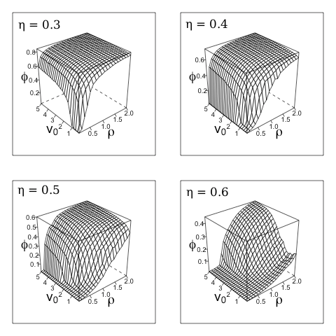

# EFFECT OF INTERACTION-RULES VARIATION ON COLLECTIVE MOTION SYSTEMS

---

# INTRODUCTION

---

## Collective motion

System of self-organized similar units that **interact** by adjusting their speed, direction of motion and distance to each other, to achieve a coherent group displacement.

The interactions are central in order for different “phases” to emerge: disorder vs. order.

Observed in a wide range of biological systems.

Note:
Its defining characteristic is that an individual action is dominated by the influence of others within a group, so each individual behaves differently as it would in solitary(non-linear system?)

A system exhibiting collective motion is made of units
- that are rather similar

- moving with a nearly constant absolute velocity
and are capable of changing their direction

- interacting within a specific interaction range by changing their direction of motion, in a way involving an effective alignment
-
- which are subject to a noise of a varying magnitude

Due to its diverse adaptive advantages, collective motion is observed in a wide range of biological systems; including bacterial colonies, social insects, fish schools, bird flocks and human crowds

---
## The study of collective motion

- Universality of the phenomenon

#### Theoretical approaches
  - Models of self-proppelled particles (SPP).
  - Variation of the rules of interaction.

#### Experimental approaches
  - High precision data of animals on the move.

https://www.youtube.com/watch?v=Y-5ffl5_7AI

---
## Rules of interaction
- Qué son
- Ventajas adaptativas

### INTRODUCTION
---

# GOALS
- Study the impact of the variation in group and individual interaction-rules:
    - Ordering,
    - Information transfer
    - Decision-making

- Compare emergent behaviors with those observed in animal collectives with flocking behavior.

---

# PRELIMINARY RESULTS

---?image=Vicsek_dynamics.png&position=right&size=35%

## Vicsek model

- Model of self-propelled particles (SPP).

- Vicsek et al. (1995).

- Integrates natural perturbations in the direction of motion.  

Note:
The model describes the dynamics of a collection of SPPs moving at a constant velocity, and at each time unit, each particle $i$ changes its orientation depending on both the average orientation of its neighbors (defined by a neighborhood of radius $R_{0}$ centered on $i$) and a noise term representing perturbations.

---

### Parameters:

- Density $\rho$: Number of particles $N$ in a volume $R^d$.

- Velocity $v_{0}$

- Noise amplitude $\eta$: white noise uniformely distributed in $[-\pi , \pi]$

- Order parameter: Average normalized velocity $\phi$,

`$$ \phi = \frac{1}{N v_{0}} \left| \sum_{i=1}^{N} \vec{v_{i}} \right| $$`

---

## Phase transitions in the Vicsek model

First order vs. Second order as a function of $\eta$

@div[left-50]

Vicsek et al., 1995
@divend

@div[right-50]

Gregoire and Chaté, 2008.  

@divend

Note:
Estudiar transiciones de fase y la diferencia entre los dos estudios.

---

### Phase transition as a function of particles' velocity

- **Fish collectives**: Higher average polarization at higher swimming speeds.

@color[blue]((Gautrais2012; Tunstrom2013, Rieucau2014))

@div[left-50]
  
@divend

@div[right-50]

@divend

Note:
Buscar rangos de velocidades en peces.

---?image=PONERIMAGEN&position=right&size=35%

## @color[purple](¿Is it possible to reproduce the velocity-dependent disorder-to-order phase transition in a model as simple as the Vicsek model?)

---?image=BOXES_IMAGE.PNG&position=right

### Our simulations

#### Computational optimization of the Vicsek model

- System $L^2$ divided in boxes of size $R_{0} = 1$, and each particle is assigned to a given box. (Ginelli et al. 2016)

- First calculate the sum of particles' orientation for each box, and update their positions aftewards.  

+++

#### Simulations

Changes in the time-average order parameter $\phi$ as particles' velocity is increased.

  - N = 10,000
  - $\rho$ from 0.1 to 2
  - Fixed eta value

---?image=eta_vs_phi_v00.05a10.png&position=right&size=48%

### To fix $\eta$

- Values of $\eta$ where disorder   
and order states are observed:

  - $\eta$ = 0.3, 0.4, 0.5 and 0.6

---
### Results: Changes in $\phi$ by changing $v_{0}$ and $\rho$

- **Disorder-to-order phase transition**

- As $\eta$ is increased, the transition ocurrs at higher $v_{0}$ and $\rho$ values.

Note:
Hacer análisis de por qué ocurre esto!
Anotar los valores de eta en cada una.

For each $\eta$, a value of $\rho$ was chosen where a transition was observed.

---?image=Phi_vs_v0_rho01a1_eta03a06_big.png&position=right&size=50%

### Nature of velocity-induced phase transition

- For each $\eta$, a value of $\rho$ was chosen where a transition was observed.

- After a $v_{0}$ threshold value, a phase transition compatible with a **first-order transition** is observed:

Note:
Which means that with little increase in velocity, theres an increase of factor 10 in the average polar order?

---
###

The relation between ordering and velocity in fish has been thought of as an adaptive trait to collectively respond to changing environmental conditions.

Being able to rapidly increase group polarization by reaching a critical velocity value would be an advantaje for the group, specially in predation risk avoidance.

#### Even in the simplest model, order is achieved by increasing the system velocity.

---?video=https://youtube.com/embed/BbuxbeLGYK8
#### FUTURE WORK

1. Study the velocity induced phase transition in fish
  - Experimental data of zebrafish (*Danio rerio*)
  - The species exhibits swarming and schooling behaviors.

2. Explore the effect of increasing velocity of only a fraction of particles on the observed phase-transition.
  - Vicsek model
  - ¿Adaptive strategy in natural systemsº?*

Note:
FOTO DE ZEBRAFISH
Poner logo de Research Group in Recreational Fisheries, Fish Ecology and Human Dimensions at the Leibniz-Institute of Freshwater Ecology and Inland Fisheries, or as a collaboration with the Research Group on Adaptive Behaviour and Interaction of the University of Barcelona.
\* As a way of saving energy but still respond efficienty
to perturbations.
---

## Kilobots
- Simple low-cost swarm robot by the Self-organizing Systems Research Group at Harvard University.

CARACTERÍSTICAS Y FOTO

+++

Setup del overhead controller, kilobots y KiloGUI

---

- Kilobots have been used to study:

1. Collective decision-making
2. Space exploratin and eficiency in information transfer
3. Collective transport of objects.

FOTOS Y VIDEOS DE LOS ESTUDIOS: Valentini2016, Dimidov2016 Rubenstein2013

---

### GOAL

- Implement and vary collective motion interaction-rules on kilobots to study leader-follower dynamics, and their impact on information transfer and collective decision-making processes.

- Relate their behavior with those of animal collectives, and on the other

- Contribute with collective algorithms with which robots swarms can efficiently fulfill complex tasks.

---
#### LOCALIZATION BY DISTANCE SENSING

- Kilobots rely only on distance measuring to obtain relative positions and orientations of nearby robots.
- They need information to collectively move.

---

### REACH ALGORITHM

Purpose: For kilobots to follow each other, no matter their initial configuration.

#### TRILATERATION
-

FIGURA 5: mejorarla para enseñar como se resuelve la ambiguedad, y luego como se acerca a el.

Kilobot B localization of reference kilobot A by trilateration using $d_{t-1}$, $d_{t}$ and the distance kilobot B moved from t-1 to t. $\beta$ angle is also shown.

---

#### RANDOM-WALK-BASED SEARCH

- First stage of implementation:
- Choosing among six possible turning angles:
  - poner los ángulos
  - Hacer dibujo de esto.

---

### KILOMBO

- C-based kilobots simulator.
- Efficient hypothesis testing.

---

VIDEOS DE ROBOTS CON ALGORITMOS, Y DIBUJO DE LO QUE FALTA.

---

### FUTURE WORK

- Mantain minimum distances among neighoring kilobots while moving collectively.

- Implement leader-follower dynamics and compare information transfer and decision-making effiency on the direction of motion for different dynamics.

---
### REFERENCES

bla bla bla
