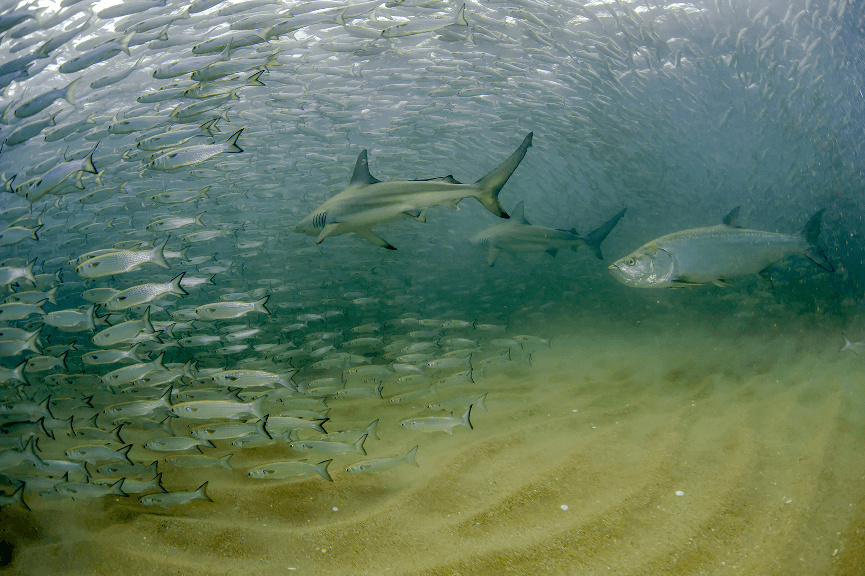
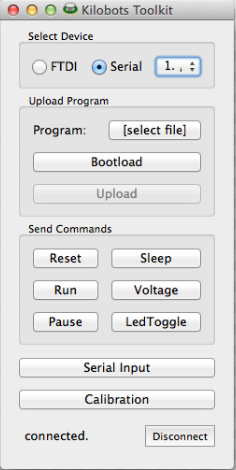

---?image=flocking_1.jpg&opacity=40
## @color[#FFBB00](EFFECT OF INTERACTION-RULES VARIATION ON COLLECTIVE MOTION SYSTEMS)
@ul[brighten]
- @color[#FFBB00](**Julia Múgica Gallart**)

- @color[#FFBB00](**Thesis directors:**)

  - @color[#FFBB00](**Dr. Romualdo Pastor-Satorras**)

  - @color[#FFBB00](**Dra. M. Carmen Miguel López**)
@ulend

---?image=flocking_birds.jpg&position=right&size=50% 100%

## @color[#FFBB00](OVERVIEW)
@ul[brighten]

- Introduction
  - Collective motion
- Main goals
- Preliminary results
  - Vicsek model of SPPs
  - Kilobots

@ulend

---?image=collective_motion.png&position=right&size=36% 60%
## @color[#FFBB00](Collective motion)
@div[left-60]
@ul[brighten]

- Similar individual units that **interact**:
  - @color[#FFBB00](Speed.)
  - @color[#FFBB00](Direction of motion.)
  - @color[#FFBB00](Distance to each other.)

- No central control: self-organization.

- Different “phases”: disorder vs. order.

- Wide range of biological systems.

@ulend
@divend

---?image=fish_tracking.png&position=right&size=30%
### @color[#FFBB00](The study of collective motion)
@ul[brighten]
- Universality of the phenomenon.
@div[left-70]
- @color[#FFBB00](Theoretical approaches)
  - Models of self-proppelled particles (SPP).
  - Variation of the @color[#FFBB00](rules of interaction.)

- @color[#FFBB00](Experimental approaches)
  - High precision data of animals on the move.

@divend
@ulend

---

## @color[#FFBB00](GOALS)
@ul[brighten]
- Study the impact of the variation in group and individual interaction-rules:

    - @color[#FFBB00](Ordering)
    - @color[#FFBB00](Information transfer)
    - @color[#FFBB00](Decision-making)

- Compare emergent behaviors with those observed in animals that exhibit collective motion.
@ulend

---

# @color[#FFBB00](PRELIMINARY RESULTS)

---?image=Vicsek_dynamics.png&position=right&size=35%

## @color[#FFBB00](Vicsek model) Vicsek et al. (1995).  

- Model of self-propelled particles (SPP).  

- @color[#FFBB00](Update position:)
`$$ \vec{x_{i}}(t + \Delta t) = \vec{x_{i}(t)} + \vec{v_{i}}(t)\Delta t $$`

- @color[#FFBB00](Update orientation:)
`$$ \theta(t + \Delta t) = \langle\theta(t) \rangle_{R_0} + \xi_{i}(t) $$`

---

### @color[#FFBB00](Parameters:)

- Density $\rho$: Number of particles $N$ in a volume $R^d$.

- Velocity $v_{0}$

- Noise $\xi$: white noise uniformly distributed in $[-\pi\eta , \pi\eta]$

- Order parameter $\phi$:Average normalized velocity,

`$$ \phi = \frac{1}{N v_{0}} \left| \sum_{i=1}^{N} \vec{v_{i}} \right| $$`

---?image=vicsek_graphs-1.png&position=right&size=35% 70%
## @color[#FFBB00](Phase transitions in the Vicsek model)

@div[left-50]

- As a function of $\eta$

`$$ \phi \sim [\eta_{c}(\rho) - \eta]^\beta $$`

- As a function of $\rho$

`$$ \phi \sim [\rho - \rho_c(\eta)]^\delta $$`

@divend

Note:

---

### @color[#FFBB00](Phase transition as a function of velocity)
@div[left-60]
@ul[brighten]

- Observations on @color[#FFBB00](fish):
  - Higher polarization ($\phi$) at higher swimming speeds ($v_0$).  Gautrais et al. 2012; Tunstrom et al. 2013, Rieucau et al. 2014

- @color[#FFBB00](Is the disorder-to-order phase transition reproducible in a model as simple as the Vicsek model?)
@ulend
@divend

@div[right-40]

@divend

Note:
Nevertheless, to our knowledge there is very few literature related to the model's dependence on particles velocity, so we wanted to fill this gap by focusing on the effect of increasing $v_{0}$ on the ordering of the system.

The occurrence of a velocity dependent phase transition has been detected in various fish species that show an increase in group's average polarization when individuals increase their swimming speed \cite{Gautrais2012}  \cite{Tunstrom2013}  \cite{Rieucau2014} (i.e. they exhibit disorder to order phase transitions). This phenomena has been analyzed in a wide group-size range (from 10 to 60,000 individuals), and in field and laboratory settings.

Here, we want to prove if it is possible to reproduce the velocity-dependent disorder to order phase transition in fish collectives in a model as simple as the Vicsek model.

?image=Figure_S10.png&position=right&size=20% 60%

Buscar rangos de velocidades en peces.

---?image=eta_vs_phi_v00.05a10.png&position=right&size=50%

### @color[#FFBB00](To fix $\eta$)
@div[left-50]
@ul[brighten]

- Values of $\eta$ where disorder and order states are observed
- N = 10,000
- Time = 100,000
- $\rho$ = 0.8 

- $\eta$ = 0.3, 0.4, 0.5 and 0.6
@ulend
@divend

---?image=Phi_vs_v0a5_vs_rhoa2_eta03a06_surface_plot_big.png&position=right&size=35%

### @color[#FFBB00](Changes in $\phi$, by changing $v_{0}$ and $\rho$)

@div[left-50]
@ul[]
- Disorder to order phase transitions.

- As $\eta$ is increased, the transition ocurrs at higher $v_{0}$ and $\rho$ values.
@ulend
@divend

Note:

For each $\eta$, a value of $\rho$ was chosen where a transition was observed.

---?image=Phi_vs_v0_rho01a1_eta03a06_big.png&position=right&size=50%

### @color[#FFBB00](Nature of velocity-induced phase transition)

@div[left-50]
@ul[brighten]
- For each $\eta$, a value of $\rho$ was chosen where a transition was observed.

- After a $v_{0}$ threshold value, a phase transition compatible with a **first-order transition** is observed.
@ulend
@divend

Note:
Which means that with little increase in velocity, theres an increase of factor 10 in the average polar order?

---
### @color[#FFBB00](Potential adaptive behavior in fish)
@div[left-50]

@divend

@divend
@div[right-50]

Note:
- A rapid increase in polarization at critical velocity value:
  - Advantage for fish in predation risk avoidance.
---?image=zebrafish.png&position=right&size=50%
#### @color[#FFBB00](FUTURE WORK)

@div[left-50]
@ul[brighten]
- @color[#FFBB00](Velocity induced phase transition in fish)
  - Experimental data of zebrafish (*Danio rerio*)
  - Fish reacting to predation stimulus.
@ulend

@divend
Note:
Aquí podría mostrar un video.

---?image=variable_v0.png&position=right&size=40%
#### @color[#FFBB00](Variable velocity within the system on the Vicsek model)
@ul[brighten]
@div[left-70]
- Increase $v_0$ to critical value of only a fraction of particles
- A disorder-to-order phase transition is still observed?
- Adaptive strategy in natural systems?
@divend
@ulend

---?image=kilobotswarm.jpg&position=right&size=45%

## @color[#FFBB00](Kilobots)

- Designed as swarm robots:
  - Simple.
  - Low-cost.
  - Small (~3cm of diameter).
  - Scalable.

- Collective decision-making.
- Space exploration.
- Collective transport of objects.

---?image=Kilobot_description.png&position=right&size=40% 90%
#### Description
@div[left-65]
- @color[#FFBB00](On-board computation power):  

- ATmega 328p microcontroller as CPU, with 32KB of memory  

- @color[#FFBB00](Nearby-robots communication and distance sensing:)  

- Infrared (IR) with 10 cm radius.  

- @color[#FFBB00](Differential drive locomotion:)  

- Rotate at 45º/s and go forward 1cm/s.  

- @color[#FFBB00](Display current state:)  

- RGB LED light.  

@divend

---?image=Overhead_controller.png&position=right&size=50%
### @color[#FFBB00](Experimental setup)
@div[left-40]

@divend

---

### @color[#FFBB00](GOALS)

- Leader-follower relationships.
  - @color[#FFBB00](Information transfer and collective decision-making.)
  - @color[#FFBB00](Different social and environmental contexts.)

- Relate their behavior with those of animal collectives.

- Contribute with collective algorithms to complete complex tasks.

---?image=reach_algorithm.png&position=right&size=50%
### @color[#FFBB00](REACH ALGORITHM)

@div[left-50]
- Localization only by distance sensing.

- First test algorithm.

- Purpose: For kilobots to reach a "leader", no matter their initial configuration.

- Trilateration of robot B to localize robot A.

@divend
@ulend

Note:

- 10 kilobots
- Smooth dry-erase whiteboard
- Overhead controller
- Charger
- Kilobot controller software

---?image=random_walk.png&position=right&size=50%

#### @color[#FFBB00](RANDOM-WALK-BASED SEARCH)

@div[left-50]
- First stage of implementation.
  - Choose among six turning angles.
  - Turn and walk forward 3 cm.
- Tuned based on Dimidov, et al. 2016
@divend

---
### @color[#FFBB00](Algorithm implementation in kilombo and kilobots)

- Kilombo: C-based simulator for kilobots (Janssen et al. 2016).
@div[left-50]

@divend
@div[right-50]

@divend
---?image=kilobot_future.png&position=right&size=30%

### @color[#FFBB00](FUTURE WORK)
@div[left-70]
@ul[]
- Mantain @color[#FFBB00](minimum distances) among neighoring kilobots while reaching the "leader"
- Implement a @color[#FFBB00](distance-compensation mechanism) for followers to follow the "leader" while moving.
- Compare @color[#FFBB00](reach-target-area efficiency) of random-walks vs. leader-following.
@ulend
@divend

---?image=v_formation.png&position=right&size=40%
- @color[#FFBB00](Implement leader-follower dynamics:)
@ul[]
@div[left-60]
- Number of neighbors.
- Preferred relative position.
- Tendency to move to specific direction.
  - Familiarity, information on food sources or predation-risk.
- @color[#FFBB00](Information transfer and decision-making effiency on the direction of motion.)

@divend
@ulend

---
#### @color[#FFBB00](WORK PLAN)

|Period                 | Activity                                                                                   
| ------------------------ | ------------------------------------------------------------------------------------------------- |
| Second year, 1-6 months  | 1. Modification and analysis of the Vicsek model to study phase transition with variable velocity.  2.  Finish reach algorithm for kilobots, and implement variation of rules. 3. Adquisition of around 150 kilobots for experimentation.                                         |     
| Second year, 6-12 months | 1. Recording and image processing of kilobots behavior under different algorithms. 2. Recording and image processing of groups of zebrafish on an experimental tank.                    |     
| Third year, 1-6 months   |1.  Analysis of kilobots results on leader-follower dynamics. 2. Comparison of fish experimental data with simulated data.                                         |     
|Third year 6-12 months   | Results publications, thesis writing and disertation.                                                                                          |     

---

### REFERENCES

---?image=human_crowd.png

# THANK YOU
